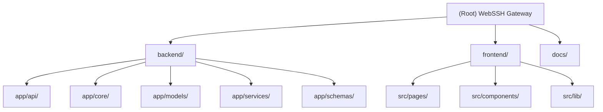

# WebSSH Gateway

Browser-based SSH gateway with enhanced session persistence (tmux-based reconnection), real-time system monitoring, file management, and multi-language support.

## Architecture Overview



## Module Index

| Module | Path | Language | Entry Point | Description |
|--------|------|----------|-------------|-------------|
| Backend | `backend/` | Python 3.11 | `app/main.py` | FastAPI server with SSH gateway, auth, file management, system monitoring |
| Frontend | `frontend/` | TypeScript/React 18 | `src/main.tsx` | SPA with terminal emulator (xterm.js), file browser, session management |
| Docs | `docs/` | Markdown | - | Architecture and deployment documentation (Chinese + English) |

## Running and Development

### Quick Start (Docker Compose)

```bash
# Configure SECRET_KEY in docker-compose.yml, then:
docker compose up -d
# Opens at http://localhost:8080
# Default admin password printed to logs on first start
```

### Backend (Development)

```bash
cd backend
python -m venv .venv && source .venv/bin/activate
pip install -r requirements.txt
export SECRET_KEY=your-32-char-key-here
uvicorn app.main:app --host 0.0.0.0 --port 8080 --reload
```

### Frontend (Development)

```bash
cd frontend
npm install
VITE_API_BASE=http://localhost:8080 npm run dev
# Opens at http://localhost:5173
```

### Environment Configuration

Key environment variables (see `.env.example` for full list):

| Variable | Default | Description |
|----------|---------|-------------|
| `SECRET_KEY` | (required) | Encryption key for JWT and auth data (16/24/32 bytes) |
| `DATABASE_URL` | `sqlite:////data/app.db` | Database connection string |
| `PORT` | 8080 | HTTP listen port |
| `JWT_ACCESS_TTL_HOURS` | 12 | Access token lifetime |
| `JWT_REMEMBER_TTL_DAYS` | 7 | Remember-me token lifetime |
| `LOGIN_LOCK_THRESHOLD` | 5 | Failed attempts before account lock |
| `SSH_ALLOW_UNKNOWN_HOSTS` | false | Allow connecting to unknown SSH hosts |
| `SSH_KNOWN_HOSTS` | (none) | Path to known_hosts file |
| `CORS_ALLOW_ORIGINS` | (none) | CORS allowed origins (comma-separated) |
| `LOG_LEVEL` | INFO | Logging level |

## API Overview

All API routes are prefixed. All authenticated endpoints require `Authorization: Bearer <token>` header.

| Route | Methods | Description |
|-------|---------|-------------|
| `/auth/login` | POST | User login, returns JWT |
| `/auth/change-password` | POST | Change current user password |
| `/auth/reset-password/request` | POST | Request password reset (generates 6-digit code) |
| `/auth/reset-password/confirm` | POST | Confirm password reset with verification code |
| `/connections` | GET, POST | List and create SSH connections |
| `/connections/{id}` | PUT, DELETE | Update and delete connections |
| `/sessions` | GET, POST | List and create SSH sessions |
| `/sessions/prepare/{connection_id}` | POST | Probe remote host capabilities |
| `/sessions/{id}` | GET, DELETE | Get or delete session |
| `/sessions/{id}/retry` | POST | Retry enhanced disconnect session |
| `/sessions/{id}/disconnect` | POST | Disconnect a session |
| `/sessions/{id}/note` | PATCH | Update session note |
| `/sessions/order` | PATCH | Reorder sessions |
| `/sessions/ws/terminal/{session_id}` | WebSocket | Terminal I/O over WebSocket |
| `/sessions/ws/sessions/{user_id}` | WebSocket | Session status updates (SSE-like push) |
| `/health` | GET | Health check |
| `/system/stats/{session_id}` | GET | Remote CPU/memory/swap |
| `/system/network/{session_id}` | GET | Remote network speed |
| `/system/processes/{session_id}` | GET | Remote process list (top 20 by memory) |
| `/system/overview/{session_id}` | GET | Remote system overview (all-in-one) |
| `/system/session-status/{session_id}` | GET | Lightweight system status for session cards |
| `/system/files/{session_id}` | GET | List directory contents |
| `/system/file/{session_id}` | GET, POST | Read/write files |
| `/system/upload/{session_id}` | POST | Upload single file |
| `/system/upload-targz/{session_id}` | POST | Upload and extract tar.gz |
| `/system/upload-zip/{session_id}` | POST | Upload and extract zip |
| `/system/upload-batch/{session_id}` | POST | Batch upload with folder structure |
| `/system/download/{session_id}` | GET | Download file or directory (as tar.gz) |
| `/system/mkdir/{session_id}` | POST | Create directory |
| `/system/touch/{session_id}` | POST | Create empty file |
| `/system/rename/{session_id}` | POST | Rename file or directory |
| `/system/chmod/{session_id}` | POST | Change file permissions |
| `/system/delete/{session_id}` | DELETE | Delete file or directory |
| `/system/disks/{session_id}` | GET | List disk mounts |
| `/system/settings` | GET, PUT | Get/Update global system settings |

## Testing Strategy

- **No tests currently exist** in this project.
- Recommended test approach:
  - Backend: pytest + httpx (async test client for FastAPI) + pytest-asyncio
  - Frontend: vitest + @testing-library/react
  - Priority areas: auth flows, session management, file operations, SSH connection lifecycle

## Coding Standards

### Backend (Python)

- Python 3.11+ with `from __future__ import annotations`
- FastAPI with Pydantic v2 for request/response validation
- SQLAlchemy 2.0 ORM with static table definitions
- Structured logging with request-id tracking via `contextvars`
- i18n catalog pattern (Chinese + English) for all user-facing messages
- Dataclass-based config with env-var loading
- All crypto uses AES-GCM (via `cryptography` library)

### Frontend (TypeScript/React)

- React 18 with functional components and hooks
- TypeScript throughout
- Tailwind CSS for styling (dark/light theme support)
- xterm.js for terminal emulation
- React Router v6 for SPA routing
- `clsx` + `tailwind-merge` for class composition

## AI Usage Guide

When working with this codebase:

1. **Adding new API routes**: Create the route file in `backend/app/api/`, register it in `backend/app/main.py::create_app()`, add schemas in `schemas/api.py`, and create the corresponding frontend API call in `frontend/src/lib/api.ts`.
2. **Adding new models**: Define SQLAlchemy model in `backend/app/models/`, then add migration bootstrap logic in `services/bootstrap.py`.
3. **i18n**: Add new message keys to both `backend/app/core/i18n.py` (server side) and `frontend/src/lib/api.ts` (client side) for any user-facing strings.
4. **Enhanced sessions**: Any change to tmux-based session persistence must also update `services/ssh_manager.py` and the auto-retry worker in `core/state.py`.
5. **Security sensitive**: Auth, crypto, and file path sanitization functions require careful review. File operations use shell sanitization to prevent command injection.

## Changelog

| Date | Change |
|------|--------|
| 2026-06-09 | Initial codebase scan and CLAUDE.md generation |
